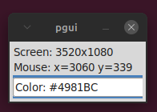

# pgui
GUI - displays mouse position and color at pointer on screen

## Modules
tkinter.ttk  
ttkthemes  
pyautogui  

Move mouse to new position and hit Enter to update output.

Tested on Linux and Windows